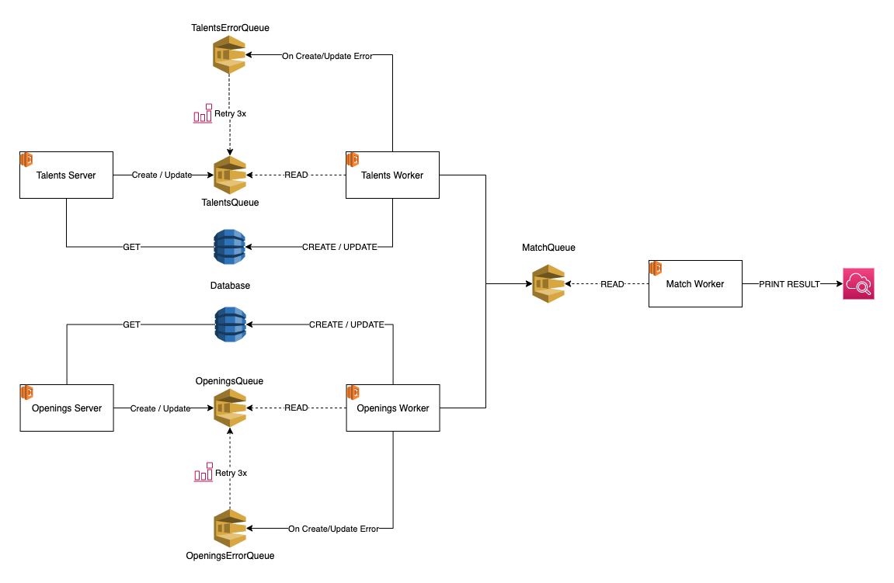

# Desafio Backend INTERA

Repostório com a solução implementada do desafio de backend da Intera.

## Estruturação

A solução completa, desde da a infra com terraform até o código das lambdas, está neste repositório. Escolhi trabalhar com monorepo simplesmente por ser mais fácil acompanhar alterações em cada serviço e infra sem ficar me perdendo entre vários repositórios desnecessariamente.

## Arquitetura

A minha proposta está baseada fortemente em microserviços, porém foi propositalmente simplificado para um melhor resultado dado o tempo x qualidade.

### Diagrama geral

Temos inicialmente 2 microserviços e 1 serviço de Match:

- [Talents](talents) - responsável pelo banco de talentos
  - server: servidor http REST ou GRaphQL simples para CRUD com comunicação de escrita via fila SQS.
  - worker: ouve mensagem de escrita via fila SQS, valida e escreve no banco de talentos.
- [Openings](openings) - responsável pelo banco de vagas e requisitos
  - server: servidor http REST ou GRaphQL simples para CRUD com comunicação de escrita via fila SQS.
  - worker: ouve mensagem de escrita via fila SQS, valida e escreve no banco de vagas.
- [Match](match) - responsável pelo match entre talentos e vagas disponíveis
  - Worker: verifica alterações no banco, informados pelo talents e openings e faz o match.

Cada serviço possui um arquivo `README.md` com mais informações e instruções.

## Tecnologias utilizadas

- NodeJS (^v14.15.4)
- Terraform (v0.14.4)
- AWS Lambda
- AWS DynamoDB
- AWS SQS

## Pontos importantes

- Índice do DynamoDB. Atualmente as tabelas do DynamoDB possui apenas 1 chave de hash, porém está longe de ser o ideal. Uma melhoria a se propor seria uma ou mais chaves de classificação, para separar os dados de acordo com tais informações. Ex: Se for importante a localidade da vaga x localidade do talento, daria para colocar o município como chave de classificação, ou talvez uma tupla de estado e município.
- O match também está longe de ser ideal com uma lambda, o ideal seria utilizar algo que os interessados no match poderiam ser informados por uma subscription. Ex: AWS SNS, onde ao acontecer um match um evento seja disparado e os "ouvintes" informados.
- Há uma taxa considerável de duplicação de código, o ideal seria trabalhar com um maior desacoplamento transferindo responsabilidades para um serviço em comúm. Ex: Utilizar uma arquitetura hexagonal separando completamente a parte de business da parte de entrada/saída de dados.
- Abusar do paradigma funcional. Esse ponto não chega ser extremamente relevante, porém eu acredito em uma maior previsibilidade no paradigma funcional. Mas independente do paradigma dá para se ter micro serviços bem feitos com boa testabilidade.
- A linguagem JavaScript é bastante produtiva mas sempre é um risco obter erros em runtime. Sempre fui entusiasta do TypeScript justamente para reduzir erros que geralmente são resolvidos com uma "compilação" com checagem de tipos.

## Build e deploy

Cada serviço tem seu próprio projeto Node isolado e cada um possui os scripts:

- Build: `npm run build`
- Verificação de conformidade com linter: `npm run lint`
- Executar testes: `npm test`

### Terraform

Para iniciar o terraform acesse a pasta "infrastructure/terraform" e execute no terminal: `terraform init`, após rodar com sucesso basta publicar com `terraform apply`, não se esqueça de sempre fazer uma revisão com `terraform plan`. Não se esqueça de ler o README do projeto infrastructure.

Cada serviço, após o build, gera uma pasta `dist` que possui de fato o código que irá para produção.

## Autor

David Vilaça - [davidpvilaca](https://github.com/davidpvilaca)
