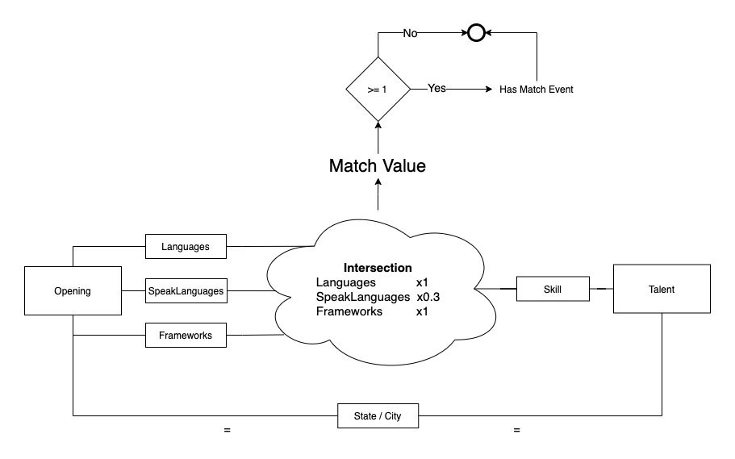

<h1 align="center">
  Match Service
</h1>

<h4 align="center">
  Serviço que realiza o match entre Talents e Openings
</h4>

  <a href="#Tecnologias">Tecnologias</a>&nbsp;&nbsp;|&nbsp;
  <a href="#Projeto">Projeto</a>&nbsp;&nbsp;|&nbsp;
  <a href="#detalhes"> Detalhes</a>&nbsp;&nbsp;|&nbsp;

 

## **Tecnologias**

Este serviço foi desenvolvido com a linguagem JavaScript (NodeJS).

## Build

Há dois scripts de build: `npm run build` que gera a pasta dist com o código fonte de produção e o `npm run build:lambda` que além de gerar todo código fonte de produção também cria um arquivo zip com eles, chamado `latest.zip`.

## **Projeto**

Basicamente o projeto possui apenas uma funcionalidade que é fazer o match entre Talents e Openings, tanto através de mensagens vinda de Openings (consultando os Talents) quanto de Talents (consultando as Openings). Esse serviço também gera um valor de match que é para ser interpretado como um critério de desempate caso haja mais de 1 match. Ou seja, quanto maior o valor do Match Value maior é a probabilidade do match ser bom.

## **Detalhes**

Este serviço é ativado através de uma trigger, quando uma mensagem é colocada em sua fila pelo Talent Service ou Opening Service. Ele se encarrega de buscar os registros no banco de dados e fazer uma interseção em alguns campos. Como é visto no diagrama acima, cada item de interseção é contabilizado com um peso, afim de gerar o Match Value. As buscas sempre levam em conta o Estado e Município, ou seja, para dar match é necessário que tanto Talent quanto Opening estejam na mesma cidade/estado.
